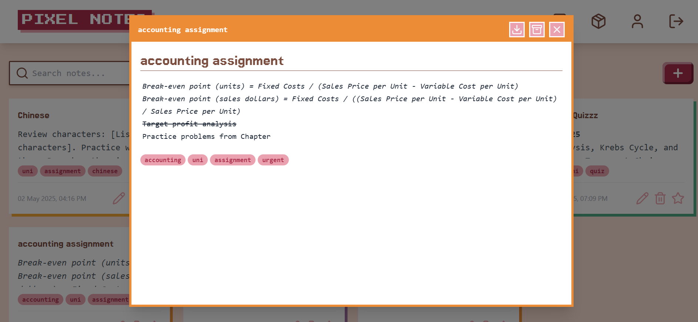
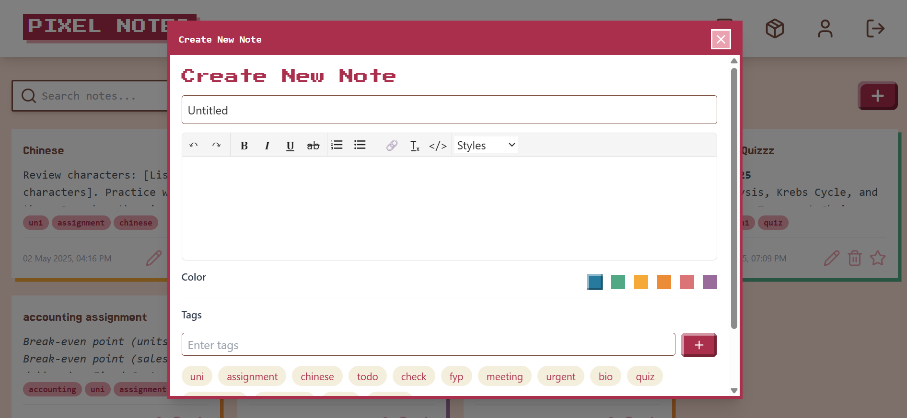
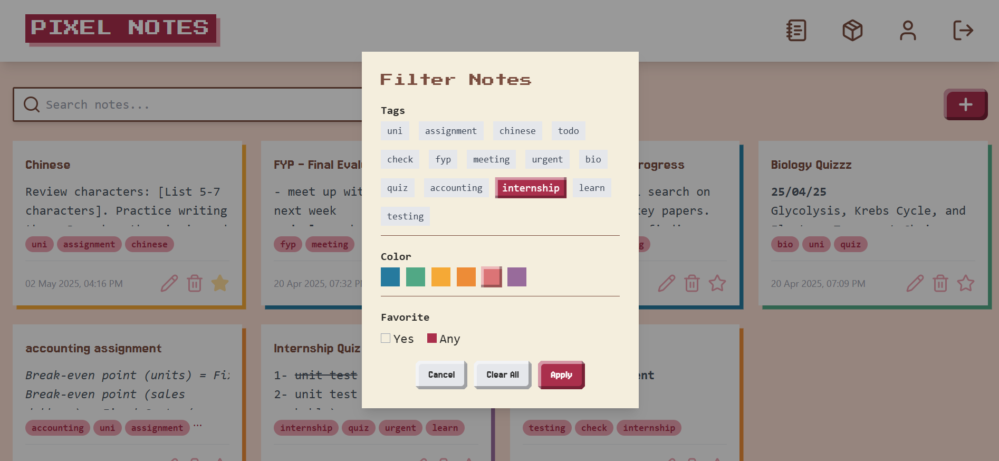

<p align="center">
  <p align="center">
  
</p>
</p>

<p align="center">
  Pixel-Perfect Note Management App 
</p>

<p align="center">
  
  
  
  
</p>

---

## About

**Pixel Notes** is a full-stack MERN application built to help users manage their notes in a minimal, and pixel-styled environment. It combines modern web development practices with a retro aesthetic to deliver a simple yet powerful note-taking experience. This project is fully modular, tested, and structured using Git best practices, developed as a requirement for the completion of 10pearls Shine Internship. 

## Features

- Create, edit, and delete notes  
- Organize by color and tags  
- Rich-text editing  
- Secure authentication with JWT  
- RESTful API backend  
- Search & filter functionality  
- Download notes in different formats  
- Pixel UI theme with smooth UX  

## Screenshots

- Sign up
<p align="center">
  
</p>

- Login
<p align="center">
  
</p>

- Home Screen
<p align="center">
  
</p>

- Detailed View of Note
<p align="center">
  
</p>

- User Profile Screen
<p align="center">
  
</p>

- Create a New Note
<p align="center">
  
</p>

- Filter By Color, Tag, Favorites
<p align="center">
  
</p>

---

## Technology

| Layer       | Tech                  |
|-------------|-----------------------|
| Frontend    | React + Vite          |
| Backend     | Node.js + Express     |
| Database    | MongoDB + Mongoose    |
| Auth        | JWT                   |
| Testing     | Mocha + Chai + Vitest |
| Logging     | Pino Logger           |


## Installation

- Clone the repo
```
git clone https://github.com/mominaamjad/pixel-notes.git
cd pixel-notes
```

- Set up Env Files
```
copy /.example.env.local to .env.local (only required for sonar qube)
copy /backend/.example.env to .env
copy /backend/.example.env.test to .env.test (only required to run backend test cases)
```

- Run Backend
```
cd backend
npm install
npm run dev
```

- Run Frontend
```
cd ../frontend
npm install
npm run dev
```

<p align="center"> © 2025 Momina Amjad. All rights reserved. </p>
